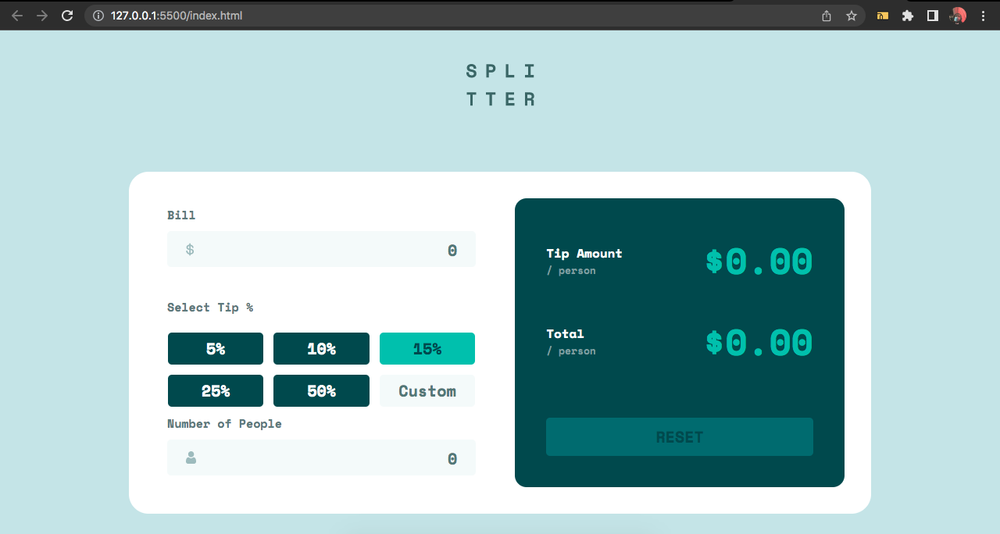

# Tip calculator app Project

## A Frontend Mentor Challenge

## Table of contents

- [Overview](#overview)
  - [The challenge](#the-challenge)
  - [Links](#links)
- [My process](#my-process)
  - [Built with](#built-with)
  - [What I learned](#what-i-learned)
- [Author](#author)

## Overview

Build the app according to the given design. Choose specific tools that is handy and customized the design freely.

### The challenge

User's flow:

- View the optimal layout for the app depending on their device's screen size
- See hover states for all interactive elements on the page
- Calculate the correct tip and total cost of the bill per person

### Links

- Solution URL: [Github](https://github.com/shagariboy/calculator-app-fc)
- Live Site URL: [Live Site](https://peppy-syrniki-0339ad.netlify.app/)

## My Process

- Utilized ClickUp to break down the workflow

### Built with

- HTML
- CSS
- SaSS
- JavasScript
- Mobile-first workflow

### What I learned

I becoming more confident in my JavaScript.

## Screenshot

## Author

- Frontend Mentor - [@shagariboy](https://www.frontendmentor.io/profile/shagariboy)
